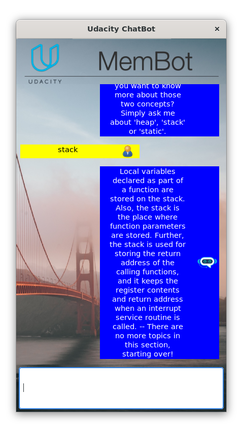

# Memory Management Chatbot

This repository optimizes code found in the
[original CPPND: Memory Management Chatbot repository](https://github.com/udacity/CppND-Memory-Management-Chatbot) from
Udacity for better memory management with modern C++ features like smart pointers and move semantics.

## Dependencies for Running Locally

* cmake >= 3.11
    * All OSes: [click here for installation instructions](https://cmake.org/install/)
* make >= 4.1 (Linux, Mac), 3.81 (Windows)
    * Linux: make is installed by default on most Linux distros
    * Mac: [install Xcode command line tools to get make](https://developer.apple.com/xcode/features/)
    * Windows: [Click here for installation instructions](http://gnuwin32.sourceforge.net/packages/make.htm)
* gcc/g++ >= 5.4
    * Linux: gcc / g++ is installed by default on most Linux distros
    * Mac: same deal as make - [install Xcode command line tools](https://developer.apple.com/xcode/features/)
    * Windows: recommend using [MinGW](http://www.mingw.org/)
* wxWidgets >= 3.0
    * Linux: `sudo apt-get install libwxgtk3.0-gtk3-dev libwxgtk3.0-gtk3-0v5`. If you are facing unmet dependency
      issues, refer to the [official page](https://wiki.codelite.org/pmwiki.php/Main/WxWidgets30Binaries#toc2) for
      installing the unmet dependencies.
    * Mac: There is a [homebrew installation available](https://formulae.brew.sh/formula/wxmac).
    * Installation instructions can be found [here](https://wiki.wxwidgets.org/Install). Some version numbers may need
      to be changed in instructions to install v3.0 or greater.

## Basic Build Instructions

1. Clone this repo.
2. Make a build directory in the top level directory: `mkdir build && cd build`
3. Compile: `cmake .. && make`
4. Run it: `./membot`.
